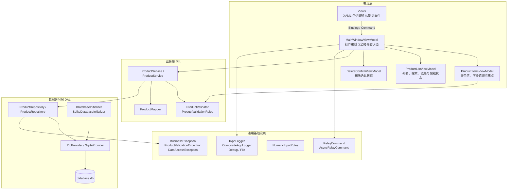
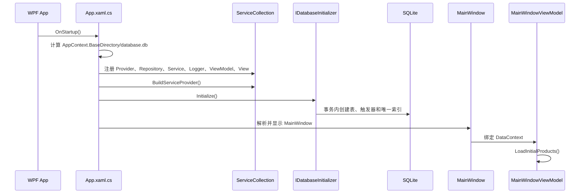
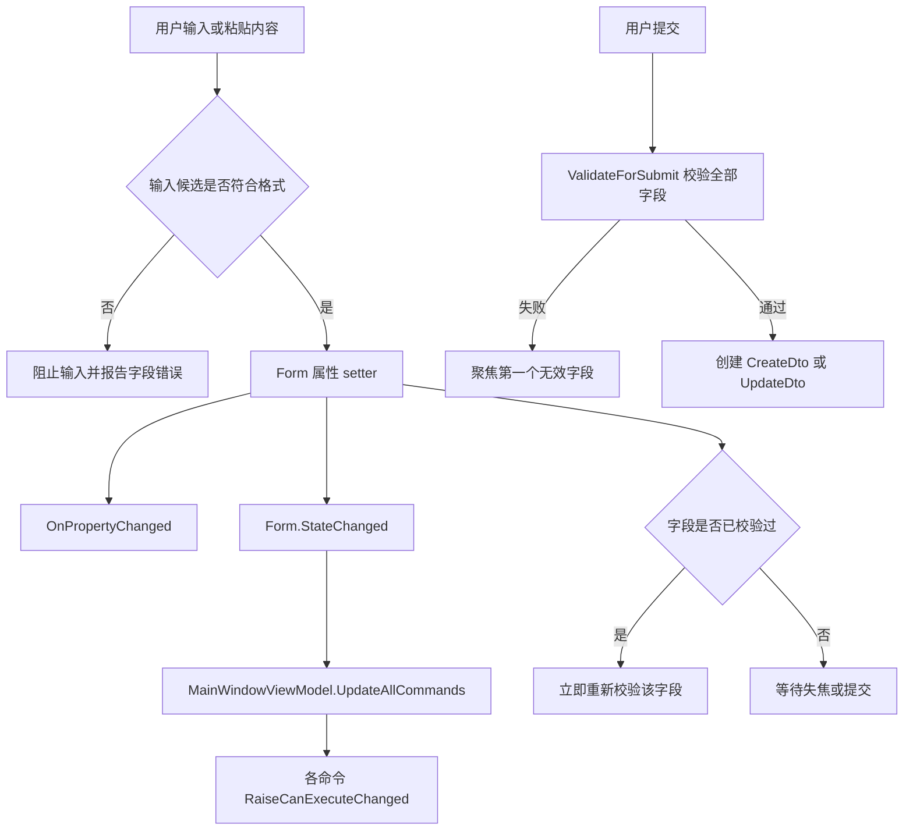
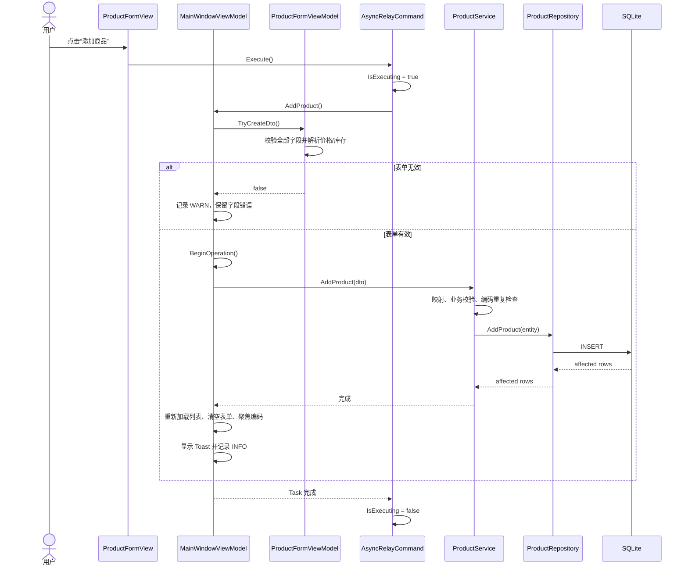
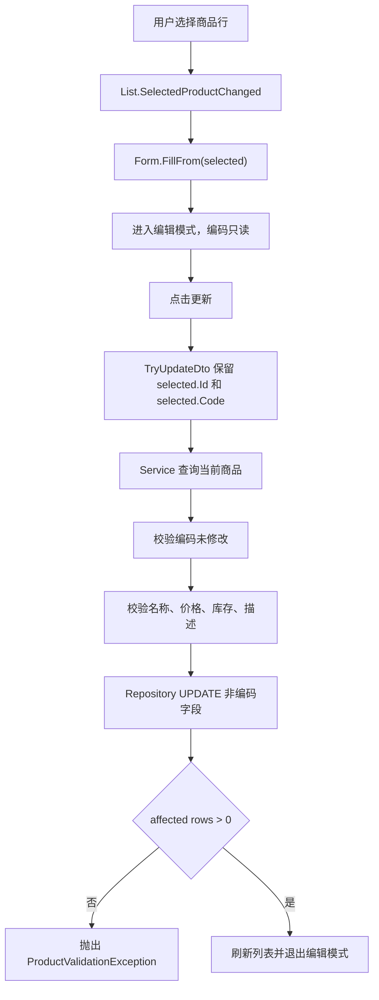
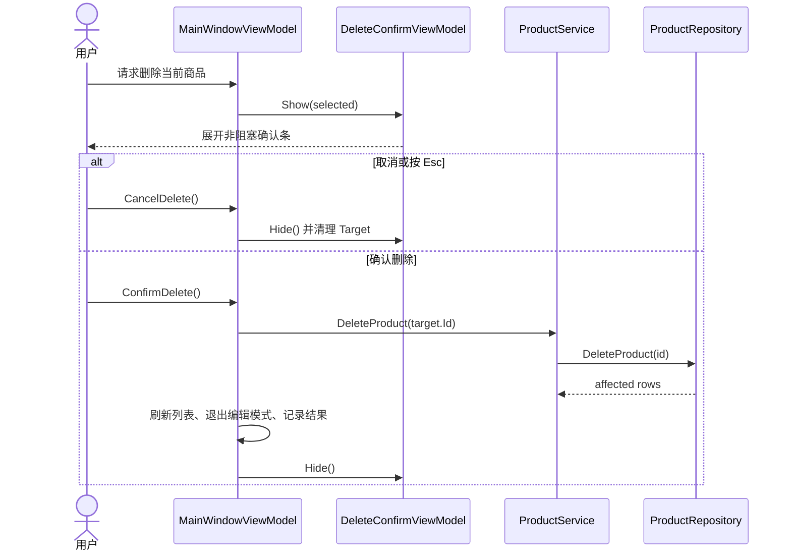
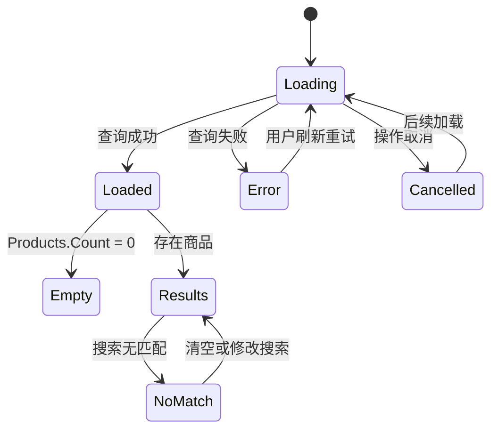
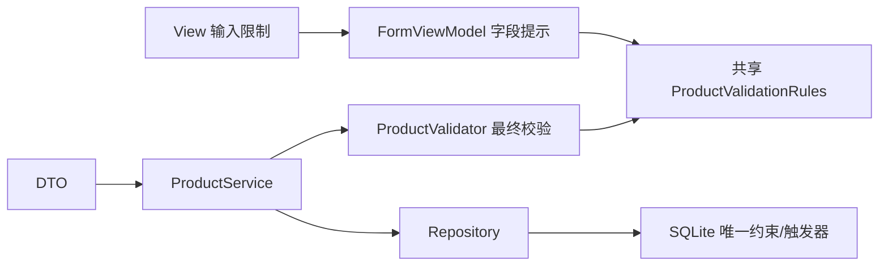
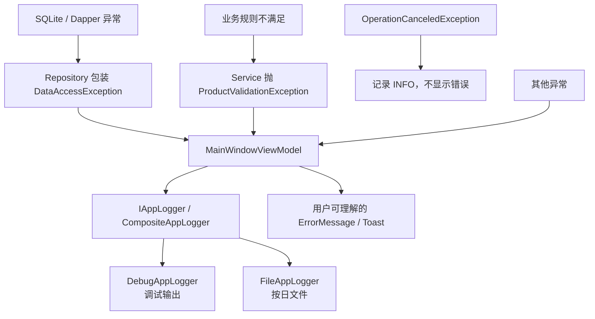

# ProductManagerApp 设计文档

本文描述当前实现的分层依赖、界面状态、CRUD 时序、异步取消、数据库初始化和异常处理。运行方式及功能清单见项目根目录的 [README.md](../README.md)。

## 1. 架构与职责

### 依赖约束

- View 不直接访问 Service、Repository 或 SQLite。
- ViewModel 通过 `IProductService` 调用业务层，不拼接 SQL。
- Service 依赖 `IProductRepository` 抽象，负责最终业务校验和 affected rows 判断。
- Repository 只处理持久化，将底层数据异常包装为 `DataAccessException`。
- `App.xaml.cs` 是组合根，负责创建依赖注入容器和启动顺序。
- DTO 用于 ViewModel 与 BLL 之间传输数据，Entity 用于 BLL 与 DAL 之间传输持久化对象。

## 2. 应用启动

数据库初始化发生在主窗口显示之前。初始化失败会阻止应用进入一个数据库结构不确定的运行状态。

## 3. 表单输入与命令状态

旧实现依赖 `CommandManager.InvalidateRequerySuggested()` 和 `Form.CanAdd()`；当前实现已改为显式状态通知和提交时校验。

`CanExecute` 只决定操作在当前模式下是否允许，例如是否选中商品、列表是否加载中、命令是否正在执行。完整业务数据校验发生在提交时，最终规则仍由 Service 再校验一次。

## 4. 新增商品时序

编码重复保护有两层：Service 在写入前按编码查询，SQLite 再通过忽略大小写的唯一索引和触发器保证最终一致性。

## 5. 编辑与更新

Repository 的更新 SQL 不包含 `code` 字段，和界面只读及 Service 校验共同落实“编码不可修改”规则。

## 6. 删除确认

## 7. 列表加载、刷新与搜索

`ProductListViewModel` 同时维护原始 `Products` 和只读的 `FilteredProducts`：

- 搜索只重建 `FilteredProducts`，不会删除原始数据。
- 编码和名称使用不区分大小写的包含匹配，并忽略搜索词首尾空格。
- 搜索结果不包含当前选择时会清除选择，避免编辑一个界面上不可见的商品。
- 刷新前记录选中 ID，加载后尝试绑定到新 DTO 实例。
- `_loadVersion` 确保旧加载任务不能覆盖较新的加载结果。
- `IsRefreshing`、`HasLoaded` 和 `LoadErrorMessage` 共同驱动加载、空、错误和重试状态。

## 8. 异步命令与取消

- `AsyncRelayCommand` 在执行前设置 `IsExecuting`，执行期间 `CanExecute` 返回 `false`，结束后恢复。
- MainWindow 同一时间只维护一个 `_cts`。`BeginOperation()` 会取消并释放旧令牌，再创建新令牌。
- `CompleteOperation()` 只清理与当前操作相同的令牌，避免旧操作的 `finally` 误释放新操作。
- 窗口关闭时调用 `CancelOperations()`，防止后台结果继续更新已关闭界面。
- 取消属于正常控制流，不显示“系统异常”，只记录 `INFO`。

当前 Service 和 Repository 是同步接口。`Task.Run` 用于避免阻塞 WPF UI，取消令牌可阻止尚未开始的任务或过期结果更新界面，但不能保证中断已经进入 SQLite 的同步调用。

## 9. 校验职责

- View：阻止价格、库存等明显无效的键盘和粘贴输入。
- FormViewModel：提供字段级文案、解析输入并聚焦首个错误字段。
- `ProductValidationRules`：保存界面与业务层共用的纯校验规则和文案。
- `ProductValidator`：业务层最终入口，校验 Entity、ID、价格和编码不可修改。
- Service：检查编码重复、商品存在性及 affected rows。
- SQLite：提供最终唯一性保障。

## 10. 数据库初始化与兼容

当前结构版本为 `1`。初始化器通过 `PRAGMA user_version` 判断需要执行的迁移，并在一个事务中完成：

1. 读取数据库当前版本，拒绝打开高于应用支持版本的数据库。
2. 按版本顺序选择所有尚未完成的迁移，版本必须从 `1` 连续递增。
3. Version 1 创建 `products` 表及新增、编码更新触发器。
4. 检查旧数据是否存在忽略大小写的重复编码。
5. 没有重复数据时创建 `ux_products_code_nocase` 唯一索引，并将 `user_version` 更新为 `1`。
6. 迁移抛出异常时回滚结构和版本号，避免留下半完成数据库。

如果旧数据库已有重复编码，Version 1 会返回“暂缓完成”：事务仍提交触发器以阻止产生更多重复项，但 `user_version` 保持 `0`，后续版本不会执行。用户清理历史重复数据后，下次启动重试 Version 1、补建索引并推进版本。已经完成的迁移不会重复执行。

## 11. 异常与日志边界

日志级别：

- `INFO`：初始加载、刷新、CRUD 成功以及取消操作。
- `WARN`：表单提交未通过或业务校验拒绝操作。
- `ERROR`：数据库访问失败和未处理异常，同时记录异常对象。

默认 `CompositeAppLogger` 同时调用 `DebugAppLogger` 和 `FileAppLogger`。文件日志写入 `%LOCALAPPDATA%\ProductManagerApp\Logs`，并使用 `ProductManagerApp-yyyy-MM-dd.log` 按日命名。文件写入使用进程内锁保证并发安全；单个日志实现失败时，组合日志仍会继续调用其他实现，日志故障不会中断业务操作。界面不会显示 SQL、堆栈或底层数据库细节。

## 12. 测试边界

测试项目当前包含 121 个测试用例，覆盖：

- Validator、共享规则、Mapper 和 Service。
- affected rows、重复编码和编码不可修改。
- AsyncRelayCommand、数字输入及粘贴规则。
- 表单、列表和主窗口 ViewModel 状态。
- 加载、取消、搜索、选择恢复、日志和用户错误提示。
- 文件日志格式、UTF-8 持久化、并发写入、失败降级和组合转发。
- ProductRepository 在真实 SQLite 上的 CRUD、affected rows、唯一约束和异常包装。
- 使用临时 SQLite 文件验证版本推进、幂等、事务回滚、高版本拒绝和旧库兼容。

大部分业务测试使用手写 Fake/Stub，避免依赖生产数据库和 WPF 窗口。Repository 保持 `internal`，通过 `InternalsVisibleTo("ProductManagerApp.Tests")` 仅向测试程序集开放。所有 SQLite 集成测试使用独立临时数据库并禁止彼此并行，释放时清理数据库及 sidecar 文件。
