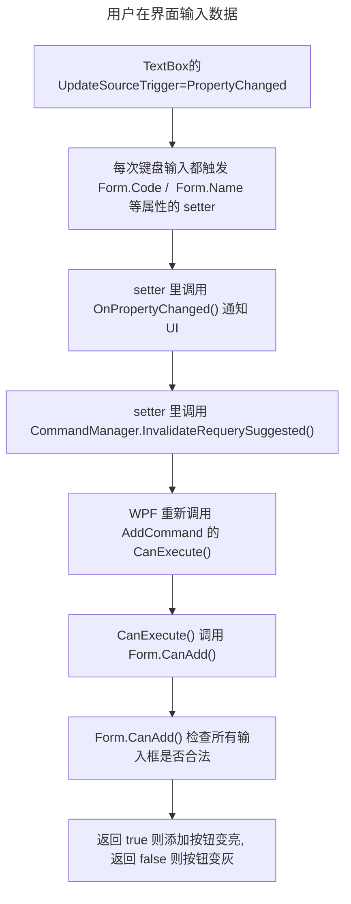

# 设计文档

## 触发阶段

```mermaid

---
title: 用户在界面输入数据
---
flowchart TD
TextBox1["TextBox的UpdateSourceTrigger=PropertyChanged"] --> keyboard1["每次键盘输入都触发 Form.Code /  Form.Name 等属性的 setter"]
keyboard1 --> setter1["setter 里调用 OnPropertyChanged() 通知 UI"]
setter1 --> setter2["setter 里调用 CommandManager.InvalidateRequerySuggested()"]
setter2 --> command1["WPF 重新调用 AddCommand 的 CanExecute()"]
command1 --> canExecute1["CanExecute() 调用 Form.CanAdd()"]
canExecute1 --> canAdd1["Form.CanAdd() 检查所有输入框是否合法"]
canAdd1 --> result1["返回 true 则添加按钮变亮, 返回 false 则按钮变灰"]
```
