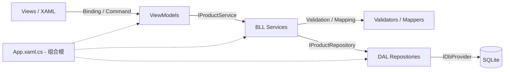

# ProductManagerApp

一个基于 **.NET 8、WPF、MVVM、Dapper 和 SQLite** 的商品管理桌面应用。项目支持商品新增、更新、删除、刷新、搜索和排序，并包含数据库自动初始化、字段级校验、异步操作状态、用户友好的异常提示及应用日志。

项目使用轻量分层结构：View 负责展示和输入，ViewModel 负责界面状态与操作编排，BLL 负责业务规则和映射，DAL 负责 SQLite 持久化。首次运行时会自动创建数据库结构，不需要手动准备 `database.db`。

## 技术栈

| 类型 | 技术 |
| --- | --- |
| 运行平台 | .NET 8 / Windows |
| UI 框架 | WPF |
| 架构模式 | MVVM + 分层架构 |
| 数据库 | SQLite |
| 数据访问 | Dapper + System.Data.SQLite |
| 依赖注入 | Microsoft.Extensions.DependencyInjection |
| 测试框架 | xUnit |

## 功能特性

- 商品新增、更新、删除和刷新
- 按商品编码或名称实时搜索
- 商品表格按 ID、编码、名称、价格和库存排序
- 新增与编辑模式清晰切换，编辑时商品编码只读
- 商品编码仅允许英文字母、数字、连字符和下划线
- 商品编码忽略大小写保持唯一，阻止重复新增
- 价格与库存输入限制和字段级错误提示
- 自动聚焦首个无效字段
- 加载、空列表、搜索无结果和加载失败状态
- 异步命令执行期间自动禁用对应操作，防止重复点击
- 非阻塞 Toast 状态提示和删除二次确认
- `F5` 刷新、`Esc` 退出编辑或取消删除、`Delete` 请求删除
- 启动时自动创建数据库表、触发器和唯一索引
- 业务异常、数据库异常和取消操作分级记录日志

## 项目结构

```text
ProductManagerApp
├─ ProductManagerApp.sln
├─ README.md
├─ ProgramFlow
│  ├─ 设计文档.md
│  └─ ScreenShot_*.png
├─ ProductManagerApp.Tests
│  ├─ BLL
│  ├─ DAL
│  ├─ Infrastructure
│  ├─ ViewModels
│  └─ Fakes
└─ ProductManagerApp
   ├─ App.xaml
   ├─ App.xaml.cs
   ├─ Assets
   ├─ BLL
   │  ├─ Interfaces
   │  ├─ Mappers
   │  ├─ Services
   │  └─ Validators
   ├─ DAL
   │  ├─ Database
   │  ├─ Providers
   │  └─ Repositories
   ├─ DTO
   ├─ Entity
   ├─ Infrastructure
   │  ├─ Commands
   │  ├─ Exceptions
   │  ├─ Input
   │  └─ Logging
   ├─ ViewModels
   │  └─ Product
   └─ Views
      ├─ Converters
      └─ Product
```

## 架构说明



依赖方向保持从界面到业务再到数据访问：

- **Views**：展示数据、转发键盘及输入事件，不直接访问 Service 或数据库。
- **ViewModels**：维护表单、列表、选择、加载和确认状态，编排异步命令并处理用户提示。
- **BLL**：执行商品业务校验、DTO/Entity 映射、唯一性检查及 affected rows 判断。
- **DAL**：管理连接、初始化数据库并执行参数化 SQL；将 SQLite/Dapper 异常包装为 `DataAccessException`。
- **Infrastructure**：提供命令、输入规则、跨层异常和日志等通用能力。
- **App.xaml.cs**：作为组合根注册依赖、初始化数据库并创建主窗口。

更详细的状态变化、CRUD 时序和异常边界见 [ProgramFlow/设计文档.md](ProgramFlow/设计文档.md)。

## 数据库说明

数据库文件名为 `database.db`，位置固定在应用程序基目录：

```text
AppContext.BaseDirectory/database.db
```

启动时 `IDatabaseInitializer` 会在事务中确保 `products` 表、编码唯一性触发器和忽略大小写的唯一索引存在。

```sql
CREATE TABLE IF NOT EXISTS products (
    id INTEGER PRIMARY KEY AUTOINCREMENT,
    code TEXT NOT NULL COLLATE NOCASE UNIQUE,
    name TEXT NOT NULL,
    price NUMERIC NOT NULL,
    stock INTEGER NOT NULL,
    description TEXT NOT NULL DEFAULT ''
);
```

编码唯一性规则：

- 查询和唯一约束均忽略大小写，`P001` 与 `p001` 被视为同一编码。
- 新数据库会创建唯一索引 `ux_products_code_nocase`。
- 如果旧数据库已经存在重复编码，初始化不会删除历史数据；触发器会先阻止继续新增重复编码。清理旧重复数据后，下次启动会补建唯一索引。

## 业务规则

- 商品 ID 必须大于 `0`。
- 商品编码不能为空，只能包含 `A-Z`、`a-z`、`0-9`、`-` 和 `_`。
- 商品编码忽略大小写唯一，新增后不可修改。
- 商品名称不能为空或只包含空格。
- 商品价格必须是有效数字且大于 `0`。
- 商品库存必须是整数且不能小于 `0`。
- 商品描述不能为空或只包含空格。
- 新增、更新和删除必须至少影响一行，否则返回明确业务错误。

界面层负责输入格式和字段级提示，`ProductValidator` 负责最终业务规则。Service 始终执行最终校验，避免绕过界面直接调用业务层时写入非法数据。

## 核心流程

### 应用启动

1. `App.xaml.cs` 创建依赖注入容器并注册 Provider、Initializer、Repository、Service、Validator、Logger、ViewModel 和 View。
2. 使用 `AppContext.BaseDirectory` 构造 SQLite 绝对路径。
3. 执行 `IDatabaseInitializer.Initialize()` 创建或修复必要数据库对象。
4. 创建 `MainWindow`，ViewModel 开始异步加载商品列表。

### 新增商品

1. `ProductFormViewModel` 校验输入并创建 `ProductCreateDto`。
2. `ProductService` 映射 Entity、执行业务校验并检查编码是否已存在。
3. `ProductRepository` 执行参数化 `INSERT` 并返回 affected rows。
4. 操作成功后重新加载列表、清空表单、聚焦商品编码并显示 Toast。

### 更新商品

1. 选择列表行后进入编辑模式并填充表单，商品编码变为只读。
2. `ProductUpdateDto` 保留被选商品的 ID 和编码。
3. Service 检查商品存在、编码未改变以及其他字段合法。
4. Repository 仅更新名称、价格、库存和描述，不更新编码。
5. 操作成功后刷新列表并退出编辑模式。

### 删除商品

1. 选择商品并请求删除，界面显示非阻塞确认条。
2. 用户确认后 Service 校验 ID，Repository 执行 `DELETE`。
3. 操作成功后刷新列表、退出编辑模式并显示结果提示。

### 搜索与刷新

- 搜索在已加载数据中按编码和名称进行不区分大小写的匹配。
- 搜索不会修改原始 `Products` 集合，清空搜索即可恢复全部结果。
- 刷新会按商品 ID 尝试恢复当前选择；若商品已不存在或被搜索条件过滤，则退出编辑模式。

## 异步与取消

- 新增、更新、确认删除和刷新使用 `AsyncRelayCommand`。
- 命令通过 `IsExecuting` 在执行期间自动禁用自身，防止重复提交。
- `MainWindowViewModel` 同一时间维护一个 `CancellationTokenSource`；新操作开始或窗口关闭时会取消并释放旧操作。
- `ProductListViewModel` 使用加载版本号阻止过期结果覆盖新结果。
- 当前 Service 和 Repository 仍是同步 API，由 ViewModel 使用 `Task.Run` 避免阻塞 UI；取消后会阻止过期结果继续更新界面。

## 异常与日志

主要异常边界：

- `ProductValidationException`：业务规则或 affected rows 不符合预期。
- `DataAccessException`：SQLite 连接、查询或写入失败。
- `OperationCanceledException`：用户关闭窗口或新操作取消旧操作，静默处理。
- 其他异常：记录后向用户显示通用提示。

`IAppLogger` 将日志能力与 ViewModel 解耦，默认 `DebugAppLogger` 输出 `INFO`、`WARN` 和 `ERROR`。日志只记录商品 ID、编码和列表数量，不记录价格、库存或描述。

查看日志：

1. 在 Visual Studio 中使用 `F5` 调试启动。
2. 打开“视图”→“输出”。
3. 将“显示输出来源”切换为“调试”。

当前实现不会写入日志文件，直接运行发布版程序时无法查看历史日志。

## 运行方式

### 环境要求

- Windows
- .NET 8 SDK
- Visual Studio 2022 或其他支持 .NET 8 WPF 的 IDE

### 构建

```powershell
dotnet build ProductManagerApp.sln
```

### 运行

```powershell
dotnet run --project ProductManagerApp\ProductManagerApp.csproj
```

### Visual Studio

1. 打开 `ProductManagerApp.sln`。
2. 将 `ProductManagerApp` 设置为启动项目。
3. 使用 `F5` 调试运行。

## 测试说明

测试项目使用 xUnit，不启动 WPF 窗口，也不访问应用输出目录中的生产数据库。

测试覆盖：

- `ProductValidator`、`ProductValidationRules` 和商品编码规则
- `ProductMapper` 的 DTO/Entity 双向映射
- `ProductService` 的查询、新增、更新、删除、重复编码和 affected rows 场景
- `AsyncRelayCommand` 的执行状态和防重复执行
- 价格、库存输入及粘贴规则
- `ProductFormViewModel` 的字段校验、DTO 创建和焦点请求
- `ProductListViewModel` 的加载、取消、错误、空状态、搜索和选择恢复
- `MainWindowViewModel` 的模式切换、命令、删除确认、异常提示和日志
- `SqliteDatabaseInitializer` 对旧数据库重复编码的兼容处理

大部分测试使用手写 Fake 或 Stub，不依赖真实数据库。数据库初始化测试会创建临时 SQLite 文件，完成验证后自动清理。

运行全部测试：

```powershell
dotnet test ProductManagerApp.sln
```

当前基线：

```text
104 个测试通过，0 个失败
```

## 当前设计约定

- 选中商品后进入编辑模式；清空表单或按 `Esc` 返回新增模式。
- 新增和编辑共用一套表单，但只有编辑模式允许更新和删除。
- 删除操作必须二次确认。
- 成功状态使用约两秒后自动消失的非阻塞 Toast。
- `Assets/Idol.jpg` 是个人设定的窗口图标资源，明确保留。
